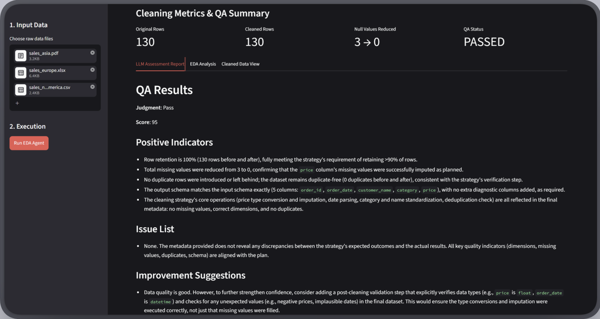
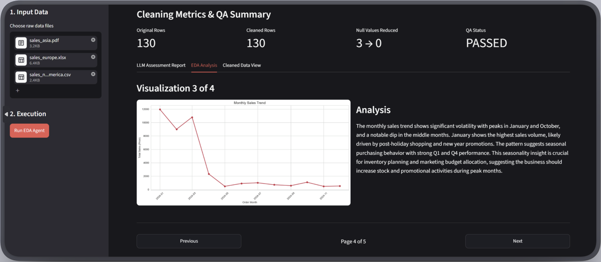

# Dataman

An intelligent data cleaning and quality assurance agent built with LangGraph. Automatically diagnoses data quality issues, generates Pandas cleaning code, executes it locally, and implements self-correction mechanisms.

## Features

- **Multi-Source Data Ingestion**: Automatically processes CSV, Excel, and PDF files from a single directory
- **Automatic Data Quality Diagnosis**: Intelligently analyzes data quality issues with awareness of multi-source artifacts
- **Code Auto-Generation**: Generates Pandas cleaning code based on diagnostic results
- **Self-Correction Mechanism**: Automatically retries on execution failure (up to 3 attempts)
- **Quality Assurance**: Automated QA validation after data cleaning
- **EDA Analysis**: Exploratory Data Analysis with automated visualization and business insights
- **Modular Architecture**: Extensible design supporting future node additions

## Architecture

### LangGraph State Flow

```
┌─────────────┐
│   START     │
└──────┬──────┘
       │
       ▼
┌─────────────┐     cleaning_plan
│  Profiler   │────────────────────┐
│    Node     │                    │
└─────────────┘                    ▼
                            ┌─────────────┐
                     ┌─────▶│   Coder     │
                     │      │    Node     │
                     │      └──────┬──────┘
                     │             │ generated_code
                     │             ▼
                     │      ┌─────────────┐
                     │      │  Executor   │
          retry_count < 3   │    Node     │
          execution_error   └──────┬──────┘
                     │             │ success
                     │             ▼
                     │      ┌─────────────┐
                     │      │     QA      │
                     └──────│    Node     │
                            └──────┬──────┘
                                   │ qa_passed
                                   ▼
                            ┌─────────────┐
                            │     EDA     │
                            │    Node     │
                            └──────┬──────┘
                                   │
                                   ▼
                            ┌─────────────┐
                            │     END     │
                            └─────────────┘
```

### Core Nodes

1. **Profiler Node**: Reads data metadata and generates cleaning strategy
2. **Coder Node**: Generates Python/Pandas code based on strategy
3. **Executor Node**: Safely executes code in isolated environment
4. **QA Node**: Validates data quality and evaluates metrics
5. **EDA Node**: Generates visualizations and business insights

## Technology Stack

- Python 3.12+
- LangGraph 1.2.10+
- LangChain (OpenAI/Anthropic/DeepSeek)
- Pandas 3.0.5+
- Matplotlib 3.11.1+
- Seaborn 0.13.2+
- TypedDict / Pydantic

## Quick Start

### 1. Install Dependencies

```bash
# Using uv (recommended)
uv sync

# Or using pip
pip install -e .
```

### 2. Generate Test Data

```bash
python scripts/generate_dirty_data.py
```

This will generate dirty data in `data/dirty_data.csv` containing the following issues:
- Missing values (NaN, None, empty strings)
- Incorrect date formats (multiple formats mixed)
- Dirty strings (spaces, special characters, inconsistent case)
- Numeric outliers (negative values, out-of-range)
- Duplicate records
- Inconsistent data types

### 3. Configure API Key

Create a `.env` file:

```bash
# OpenAI
OPENAI_API_KEY=your_key_here

# Anthropic Claude
ANTHROPIC_API_KEY=your_key_here

# DeepSeek
DEEPSEEK_API_KEY=your_key_here
```

### 4. Run the Agent

```bash
python scripts/run_agent.py
```

## Project Structure

```
Dataman/
├── src/
│   ├── core/
│   │   ├── state.py          # LangGraph State definitions
│   │   └── graph.py          # Graph construction logic
│   ├── nodes/
│   │   ├── profiler.py       # Data analysis node
│   │   ├── coder.py          # Code generation node
│   │   ├── executor.py       # Code execution node
│   │   ├── qa.py             # Quality assurance node
│   │   └── eda.py            # EDA analysis node
│   ├── utils/
│   │   └── data_loader.py    # Data loading utilities
│   └── prompts/              # Prompt templates
├── scripts/
│   ├── generate_dirty_data.py
│   └── run_agent.py
├── data/                     # Input data
├── outputs/                  # Cleaning results
│   ├── cleaned_data.csv      # Cleaned dataset
│   ├── final_report.md       # Execution report
│   └── plots/                # EDA visualizations
└── logs/                     # Log files
```

## Core Concepts

### State Design

```python
class DataCleaningState(TypedDict):
    original_df_info: Dict[str, Any]      # Original data metadata
    cleaning_plan: Optional[str]          # Cleaning strategy
    generated_code: Optional[str]         # Generated code
    execution_error: Optional[str]        # Execution error
    retry_count: Annotated[int, operator.add]  # Retry counter
    cleaned_df_info: Optional[Dict[str, Any]]  # Cleaned data info
    qa_result: Optional[Dict[str, Any]]   # QA results
    eda_plan: Optional[str]               # EDA insights
    eda_code: Optional[str]               # EDA plotting code
    # ...
```

### Self-Correction Loop

When code execution fails:
1. `execution_error` records the Traceback
2. `retry_count` increments
3. If `retry_count < 3`, routes back to Coder Node
4. Coder Node uses error information to regenerate code
5. Terminates after 3 failed attempts

### Quality Assurance

The QA Node performs:
- **Deterministic Rule Checks**: Data retention rate, missing value improvement, duplicate removal, column stability
- **LLM-based Assessment**: Intelligent evaluation comparing before/after data and cleaning strategy
- **Comprehensive Scoring**: Combined score from rule checks (60%) and LLM assessment (40%)

### EDA Analysis

The EDA Node generates:
- **Distribution plots** for numeric columns
- **Bar charts** for categorical columns
- **Correlation heatmaps** for numeric relationships
- **Business insights** in Markdown format

## Output Files

After execution, check these files:

- `outputs/cleaned_data.csv` - The cleaned dataset
- `outputs/final_report.md` - Complete execution report including:
  - Execution status and retry count
  - Data cleaning effectiveness metrics
  - QA validation results
  - LLM assessment report
  - EDA business insights
- `outputs/plots/*.png` - Generated visualizations

## Testing

A comprehensive unit test suite with 36 tests is included to ensure code quality and reliability.

### Run Tests

```bash
# Install test dependencies
uv pip install pytest pytest-mock pytest-cov

# Run all tests
python -m pytest tests/ -v

# Run with coverage report
python -m pytest tests/ --cov=src --cov-report=html
```

### Test Coverage

- **State Initialization** (5 tests): Validates AgentState creation and default values
- **Graph Routing Logic** (9 tests): Tests conditional routing and self-correction paths
- **Executor Sandbox** (11 tests): Tests safe code execution and error handling
- **QA Deterministic Rules** (11 tests): Validates quality assurance thresholds

All tests use mocked LLM calls to ensure instant execution without consuming API credits.

**Test-Driven Bug Fixes**: During test development, 2 out of 36 tests initially failed, revealing actual bugs:
1. **Syntax Error Test Fix**: The test case's "bad code" didn't contain an actual syntax error (a comment is valid Python). Fixed by adding a real syntax error (missing closing parenthesis).
2. **None Handling Bug in `route_after_qa`**: Discovered that `state.get("qa_result", {})` returns `None` (not `{}`) when the key exists with a `None` value. Fixed the source code in `src/core/graph.py` by changing to `state.get("qa_result") or {}` to properly handle `None` cases.

See [tests/TESTING.md](tests/TESTING.md) for detailed testing documentation.

## Web Application (Streamlit UI)

The project includes a production-ready web interface built with Streamlit, providing an intuitive way to interact with the multi-agent data cleaning pipeline.



### Key Features

#### 1. Multi-Source Data Upload
- Drag-and-drop interface supporting CSV, Excel (.xlsx), and PDF files
- Automatic data ingestion from heterogeneous sources
- Real-time file processing with metadata display (file counts by type, warnings)

#### 2. Real-Time Execution Progress
- Live status tracking of each pipeline stage:
  - Profiler: Diagnosing data quality issues
  - Coder: Generating Python cleaning script
  - Executor: Running code in sandbox environment
  - QA Node: Validating retention rate and data quality rules
  - EDA Node: Generating visualizations and business insights
- Visual feedback with expandable status containers

#### 3. Interactive Results Dashboard

The application presents results in three organized tabs:

**Tab 1: LLM Assessment Report**
- Displays the comprehensive QA evaluation from the LLM
- Shows deterministic rule check results (retention rate, missing values, duplicates)
- Presents the combined quality score and pass/fail status
- Lists specific issues detected and improvement suggestions

**Tab 2: EDA Analysis**

- Interactive pagination with Previous/Next navigation
- Page 0: High-level dataset summary with visualization count
- Pages 1-N: Individual plot pages with side-by-side layout
  - Left column: Full-resolution chart image
  - Right column: Plot-specific interpretation and business insights



**Tab 3: Cleaned Data View**
- Interactive data preview (first 20 rows for performance)
- Dataset shape information (rows × columns)
- Per-column missing value breakdown with expandable section
- Visual warning indicators for remaining data quality issues

#### 4. Data Export
- One-click download of the complete cleaned dataset as CSV
- Works even when QA validation fails, enabling debugging

#### 5. Metrics Summary
- Plain metrics displayed:
  - Original row count vs. Cleaned row count
  - Missing values before/after cleaning
  - QA validation status (PASSED/FAILED)

### Running the Web Application

```bash
# Ensure dependencies are installed
uv sync

# Launch the Streamlit app
streamlit run app.py
```

The application will open in your browser at `http://localhost:8501`.

### Technical Implementation

**State Management**
- Uses `st.session_state` to persist execution results across re-runs
- Separate state tracking for EDA pagination (`eda_page`) to enable smooth navigation
- Session state reset on new pipeline execution to prevent stale data

**Backend Integration**
- Calls `run_agent_pipeline()` from `scripts/run_agent.py` as API
- Loads full cleaned dataset from disk (`outputs/cleaned_data.csv`) rather than passing through state
- Memory-efficient architecture: DataFrame not kept in state during graph execution

**UI Architecture**
- Stable container pattern in Tab 2 prevents Streamlit tab jumping on layout changes
- Dynamic plot filtering with `os.path.exists()` ensures robust rendering
- Structured JSON format from EDA Node enables rich, interactive visualization presentation

**Debug Features**
- Terminal logging of per-column missing values after code execution
- Console warnings for missing plot files
- Failed data always accessible for debugging via download button

### Troubleshooting

**Issue: Download button provides truncated data**

**Solution**: The app now reads the full dataset from the saved CSV file on disk. Ensure `outputs/cleaned_data.csv` exists after pipeline execution.

**Issue: Tab jumps to first tab when clicking Next**

**Solution**: This has been fixed by wrapping Tab 2 content in a stable `st.container()`. Update to the latest version of `app.py`.

## Development Roadmap

- [x] Project structure setup
- [x] State definitions
- [x] Dirty data generation script
- [x] Profiler Node implementation
- [x] Coder Node implementation
- [x] Executor Node implementation
- [x] QA Node implementation
- [x] EDA Node implementation
- [x] LangGraph workflow construction
- [x] Self-correction mechanism
- [x] English-only enforcement
- [x] Unit tests (36 tests, 100% passing)
- [x] Streamlit web application with interactive UI
- [x] Paginated EDA visualization with side-by-side layout
- [x] Multi-source data ingestion (CSV/Excel/PDF)
- [ ] Logging and monitoring
- [ ] Additional EDA node enhancements

## Configuration

### LLM Provider

The agent supports multiple LLM providers:
- **DeepSeek** (default for Profiler, Coder, QA, EDA)
- **OpenAI GPT-4**
- **Anthropic Claude**

Configure via environment variables in `.env`.

### Retry Limits

Modify the retry limit in `src/core/graph.py`:

```python
if retry_count < 3:  # Change 3 to your desired limit
    return "coder"
```

## License

MIT License

## Contributing

Issues and Pull Requests are welcome! Please ensure:
- All code comments are in English
- Follow the existing code style and architecture
